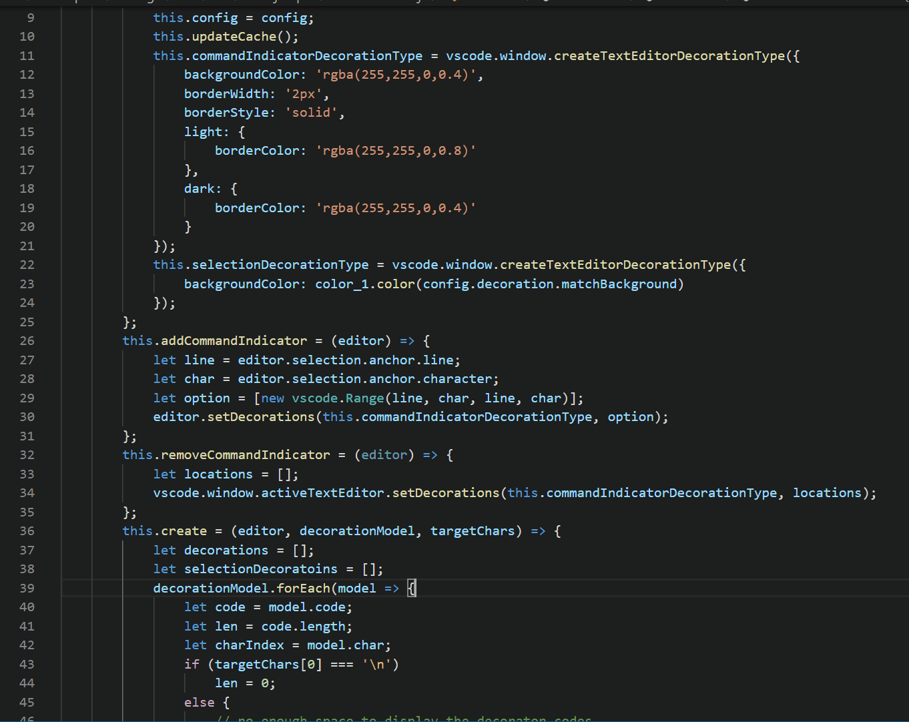
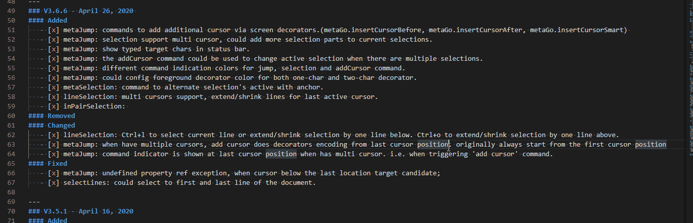
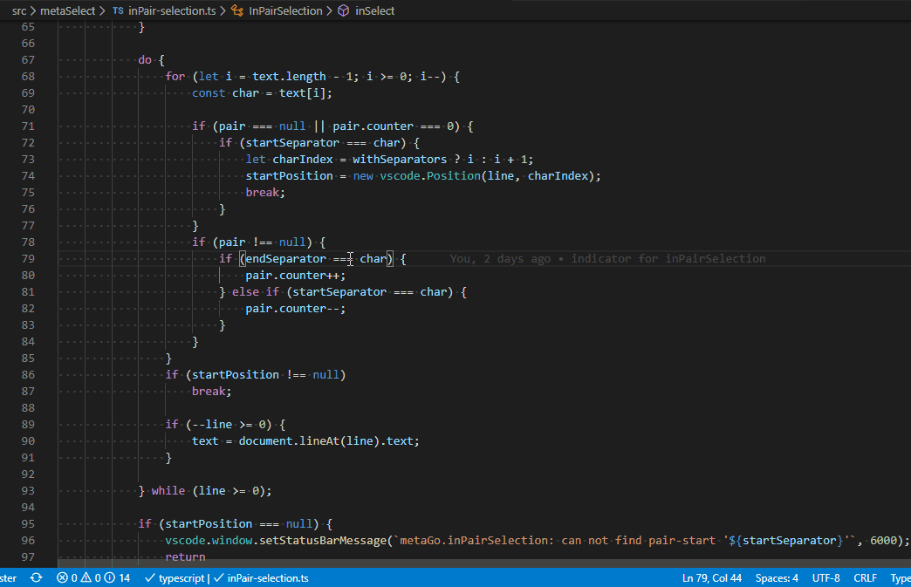
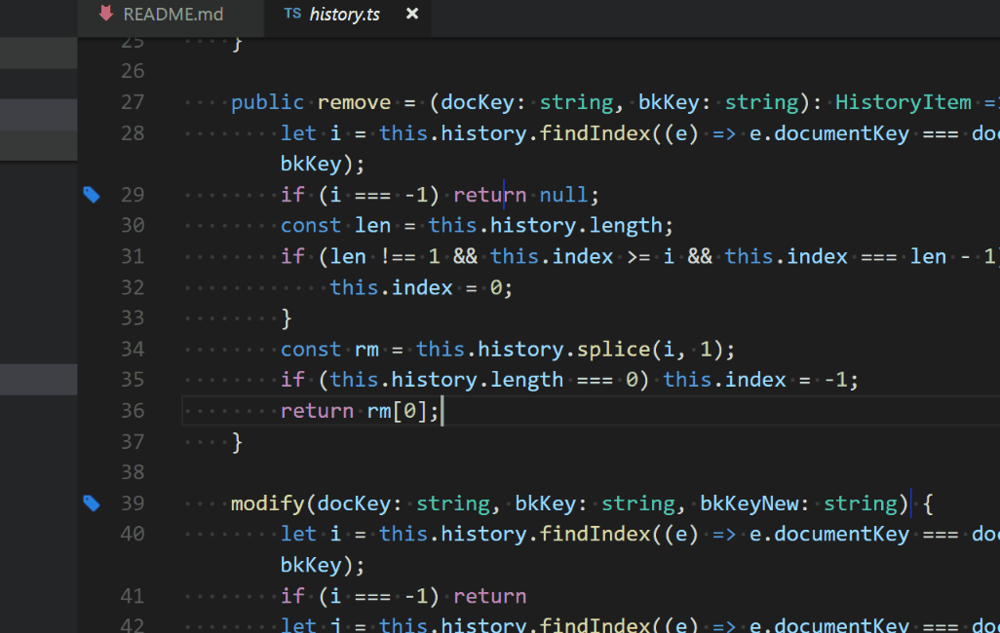
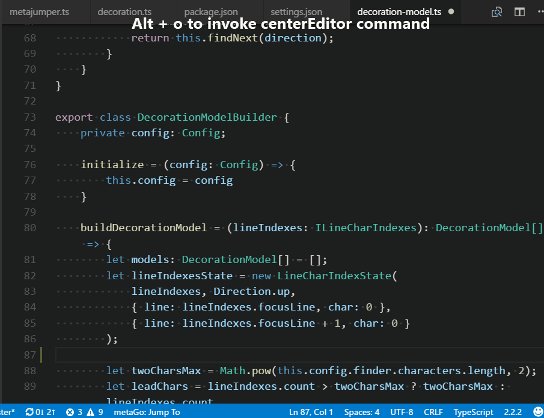
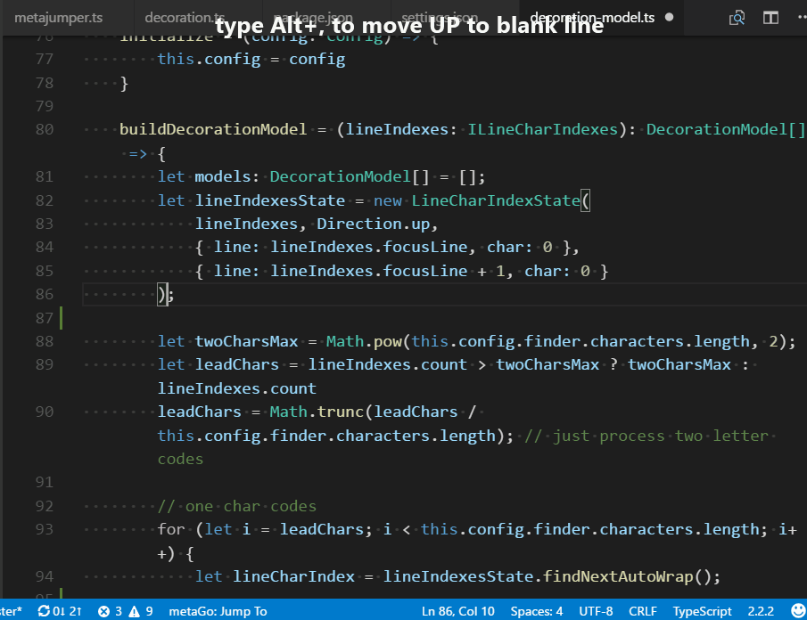

[](https://marketplace.visualstudio.com/items?itemName=metaseed.metago)
[](https://marketplace.visualstudio.com/items?itemName=metaseed.metago)
[](https://marketplace.visualstudio.com/items?itemName=metaseed.metago)


[](https://twitter.com/metaseed)
[](https://gitter.im/vscode-metago/community)
---

 **Attension: In V3 we changed Metajump command names and the command default trigger keys**

First of all, Metago is a tool made for myself, it comes from the voice in my heart💖as a programmer.    
Metago tries its best to be the coolest😎 keyboard(mouseless) focused navigation tool in vscode.    
Metago tries to make your keyboard⌨ to you as meaningful as a kitchen knife to a masterchef👩‍🍳.    

<br>
Metago as an free tool, currently is mentained and developed by me in my spare time🌙⏳, if you think it's useful to you or even indispensable like some of our users, please support me, just buy me a drink☕ would be a great inspiration for me, which means there is someone really like it. 😊

Give me a  [github⭐](https://github.com/metaseed/metago)
<table align="center" width="40%" border="0">
  <tr>
    <td>
      <a href="https://www.paypal.com/cgi-bin/webscr?cmd=_donations&business=P9GXHBAAHPBMN&item_name=metago+dev&currency_code=USD&source=url">
          
      </a>
      <br>
    </td>
    <td>
      <a href="https://github.com/metaseed/metaGo/blob/master/donate/index.md">
          
      </a>
    </td>
  </tr>
</table>
<br>
<br>

quotes from users:
> [Wicked fast cursor movement/selection for a focus on keyboard usage. This changed how I use VS Code forever. Seriously.](https://spectrum.chat/frontend/general/favourite-vs-code-extensions~9ad33139-aa3a-4f8e-a640-d08ba08736b0)

> [This boosts my performance so much since It’s a trouble for me to use VIM (I’m leftie :( )](https://medium.com/@ColCh/i-found-also-these-plugins-very-helpful-in-my-work-df795a9e929f)

> [probably the best tool for keyboard driven navigation bar none (better than vim), includes bookmarks](https://dev.to/fbnlsr/10-essential-extensions-for-vscode-174i#comment-node-140785)

> [MetaGo is a way to move your cursor to a position quickly and without using your mouse/trackpad.](https://scotch.io/starters/visual-studio-code/metago)

> [Oh, man.. I have a feeling that after that I'm going to feel crippled without it. This is fantastic.](https://www.reddit.com/r/vscode/comments/6wcucw/mouseless_setup/#t1_dm8ka1b)

> and MORE from you... 

With this new V3 released, we are going to add more features, peek features in dev:
* hold <kbd>/</kbd> to hide jumper decorators on screen.(Done😉)
* jumper commands for all opened editors, not just the active editor.(Done!)
* support having fold regions.(V3.2 Done!)
* ripple jump support to show less decorators on screen. one target-char for current section(seperated by empty lines), two target-chars for current document editor, three or more for all open editors.(V3.5 Done!)
* improved line-selection extend/shrink command. (V3.6 Done!)
* command to add multiple cursors, and multiple cursor/selection support for all command in metaGo (V3.6 Done!)
* command to change active selection in multiple selections (V3.6 Done!)
* command to select within separator pairs. i.e. '(', ')'; '[',']', '"',''',... (V3.6 Done!)
* and more... at [changelog](https://github.com/metaseed/metaGo/blob/master/CHANGELOG.md)
if you have andy suggestion just open an [issue on github](https://github.com/metaseed/metago/issues) or contact with us on [Gitter☕](https://gitter.im/vscode-metago/community)

## Features Summary
MetaGo provides fast cursor movement/selection for keyboard focused users:
* [MetaJump](https://github.com/metaseed/metaGo/blob/master/README.md#metajump)
    * [features highlight](https://github.com/metaseed/metaGo/blob/master/README.md#features-highlight)
    * [go to any character on screen with 3(most cases) or 4 times key press](https://github.com/metaseed/metaGo/blob/master/README.md#go-to-any-character-on-screen)
    * [select to any character in the active editor](https://github.com/metaseed/metaGo/blob/master/README.md#select-to-any-character-in-the-active-editor)
    * [add multiple cursors to the active editor](https://github.com/metaseed/metaGo/blob/master/README.md#select-to-any-character-in-the-active-editor)
    * [change active selection in multiple selections](https://github.com/metaseed/metaGo/blob/master/README.md#change-active-selection-in-multiple-selections)

* [MetaSelection](https://github.com/metaseed/metaGo/blob/master/README.md#metaselection)
    * [alternate Selection's active with anchor](https://github.com/metaseed/metaGo/blob/master/README.md#alternate-selections-active-with-anchor)
    * [lines selection](https://github.com/metaseed/metaGo/blob/master/README.md#lines-selection)
    * [inside-pair selection](https://github.com/metaseed/metaGo/blob/master/README.md#inside-pair-selection)

* [Navigate between files using bookmarks](https://github.com/metaseed/metaGo/blob/master/README.md#navigate-between-files-using-bookmarks)

* [Other features](https://github.com/metaseed/metaGo/blob/master/README.md#other-features)
    * []
* moving cursor up/down between blank lines.
* select code block when moving cursor while hold shift key.
* scroll the active line (contains cursor) to the screen Top/Middle/Bottom.
* select line up/down.
* compatible with the vim plugins.


> if you like this tool, and using Windows, you may also be interested in my other tool: [**metaTool**](https://github.com/metatool/metatool). (release soon) 😉    
> with metaTool running with it's metaKeyboard plugin, you just using the 61 keys main keyboard area to type any key you want.
>
> i.e. to jump next blank line in the document, currently the default trigger is <kbd>Alt</kbd>+<kbd>End</kbd>, now you could use<kbd>LAlt</kbd>+<kbd>;</kbd>, because <kbd>LAlt</kbd>+<kbd>;</kbd> is expanded to <kbd>Alt</kbd>+<kbd>end</kbd>

## MetaJump

### features highlight
* code characters are based on priority, the character easier to type has higher priority. i.e. 'k','j', and code characters are configurable.
* code character decorator is encoded with 1 or 2 characters, the code characters around cursor are easier to type.
* only encode characters on viewable screen area, so metaGo is faster.
* support having fold regions
* support jumping to all opened editors
* work with vim plugin

### go to any character on screen
1. type <kbd>Alt</kbd>+<kbd>/</kbd> to tell I want to *go* somewhere. (Trigger)
2. type the characters(stands for the target location) on screen, metaGo will show you some decorator codes(candidate target locations) encoded with characters. (you could hold the <kbd>/</kbd>(configurable) to hide the location decorators, release to show again)
3. you could continue type characters following the target location to narrow down the possible targets range, or type the code decoration characters of one location to *go* to that target location.

> at any time press <kbd>ESC</kbd> to cancel the command; <kbd>Backspace</kbd> to cancel last typed char in target-char-sequence. (<kbd>Backspace</kbd> triggers 'step-cancel')    

> Ripple Support, Less Decorators On Screen: type location-chars to encode locations far from center(cursor location): 
> 1. one target-char for current section(separated by empty lines);
> 1. two target-chars for current doc;
> 1. three or more target-chars for all opened editors;
> 1. for one or two target-chars, one-char-decorators will pass through boundaries(section or document) if possible. (i.e. for one-target-char, one-char-decorators has encoded all possible target locations in the section, then it will continue encodes until all one-char-decorators are used up).

* the <kbd>Alt</kbd>+<kbd>.</kbd> shortcut will trigger the metaGo.gotoAfter command, the cursor will be placed after the target character;    
* the <kbd>Alt</kbd>+<kbd>,</kbd> shortcut will trigger the metaGo.gotoBefore command, the cursor will be placed before the target character;
* the <kbd>Alt</kbd>+<kbd>/</kbd> shortcut will trigger the metaGo.gotoSmart command which intelligently set cursor position after navigation:
    * if the target is at the begin of the word, the cursor will be set before target character, otherwise after it;
    * The 'word' is defined as a group of all alphanumeric or punctuation characters.

> Note: <kbd>Enter</kbd> is also usable as location character, it means the end of line. You could press <kbd>Enter</kbd> any times to trigger the decorator-encoding for the line-end out side of current section(2 times) or document(3 times). (like a ripple)    
> commands that only navigate in the active editor are also provided: metaGo.gotoAfterActive, metaGo.gotoBeforeActive, metaGo.gotoSmartActive, you could assign shortcuts by yourself.

### select to any character in the active editor
1. type <kbd>Alt</kbd>+<kbd>Shift</kbd>+<kbd>/</kbd> to tell I want to *select* to somewhere.
2. type the character(stands for location) on screen, metaGo will show you some codes encoded with character.
3. type the code characters, you will *select* to that location.
4. repeat 1-3 to adjust your current selection.
> at any time press <kbd>ESC</kbd> to cancel, or press <kdb>Backspace</kbd> to do step cancel to re-input last typed character

> support to do multiple selections, 



### add multiple cursors to the active editor
1. <kbd>Ctrl</kbd>+<kbd>Alt</kbd>+<kbd>,</kbd> to add another cursor before the target-character
1. <kbd>Ctrl</kbd>+<kbd>Alt</kbd>+<kbd>.</kbd> to add another cursor after the target-character
1. <kbd>Ctrl</kbd>+<kbd>Alt</kbd>+<kbd>/</kbd> to add another cursor smartly to the target-character

> <kbd>Ctrl</kbd>+<kbd>u</kbd> to cancel last cursor action.

#### add-multi-cursors demo
we want to modify the three wrongly spelled words, `alt+/` to goto the end of one of them, and `ctrl+alt+/` two times to add two additional cursors to the end of the other two words, `ctrl+backspace` to delete them together, `esc` to escape multi-cursor mode:


### change active selection in multiple selections
> the three add-cursor commands would become change-active-selection commands if the target location is inside a selection. It is useful to modify multiple selection ranges, just select one selection as the active one and do extending or shrinking there.
#### change-active-selection demo
we use `alt+shift+/` do selection, then `alt+a` to alternate selection's active with anchor, then `alt+shift+/` to extend selection from another end; then we use `ctrl+alt+/` to add another cursor to code above, `alt+shift+/` to do selection, then `ctrl+alt+/` to make the first selection active, `alt+shift+/` to shrink selection there:


## metaSelection

### alternate Selection's active with anchor
* <kbd>Alt</kbd>+<kbd>a</kbd> to alternate the selection's active(cursor flashing) with the anchor.

### lines selection
vsCode's default select current line command(`Ctrl+l`) selects current line and puts the cursor at the next line's start position.
we create our own to extend/shrink the selection of the current line:
* <kbd>Ctrl</kbd>+<kbd>l</kbd> to select current line if no selection at cursor, or extend/shrink selections by one line below if there is selection before/after the cursor.
* <kbd>Ctrl</kbd>+<kbd>o</kbd> to extend/shrink selection by one line above if there is selection after/before the cursor.

> extend/shrink selections work at the selection's active end(where cursor flashing), if you want to extend/shrink at the selection's anchor end, use <kbd>Alt</kbd>+<kbd>a</kdb> to alternate selection's anchor with active at first. 

> note: <kbd>Ctrl</kbd>+<kbd>o</kbd> triggers open file by default, and it triggers extend line selection above only when there is selection in active editor.

> if you want to select line up, you should press <kbd>Ctrl</kbd>+<kbd>l</kbd> to select current line and then press <kbd>Ctrl</kbd>+<kbd>o</kbd> to extend line selection above.

by default selectLineUp command is configured as:
```json
{
    "command": "metaGo.selectLineUp",
    "key": "ctrl+o",
    "when": "editorTextFocus && editorHasSelection"
}
```
you could assign a shortcut key not collision with default vscode ones, just remove the `editorHasSelection` condition, so it works even with no selection in editor.

#### lineSelection demo
we use `ctrl+l` to select current line, then `ctrl+l` again to extend current selection below, then `ctrl+o` to shrink current selection above, then `alt+a` to alternate the current selection's active end with anchor end, then `ctrl+o` to extend current selection above, then `ctrl+alt+/` to add another cursor, and `ctrl+l` to select current line, `ctrl+l` again to extend selection below, then `alt+a` to alternate selection's active with anchor, then `ctrl+o` to extend selection above. 


With the two selections, you could then delete or copy...


### inside-pair selection
commands to select content inside a pair of separators: '(',')'; '[',']'; '{','}';'<','>'; '>', '<'; or any char pair: '''; '"'...

1. <kbd>Alt</kbd>+<kbd>p</kbd>: I want to select inside a pair of chars.
2. type the start character of the pair. i.e. '(', '[', '{', '"'...

> Note: <kbd>Alt</kbd>+<kbd>Shift</kbd>+<kbd>p</kbd> to selection both the content and the pair of separators.

> it supports multiple cursors/selections

#### inside-pair-selection demo
we use `alt+p (` to select content inside the '(' and ')', then `alt+p {` to extend selection, then `alt+p {` to extend further, then `alt+shift+p {` to include then pair('{'and '}') in the selection, then `alt+shift+p` to extend the selection further with the pair('{' and '}') included.

## navigate between files using bookmarks

* <kbd>Alt</kbd>+ <kbd>\'</kbd> to toggle a bookmark at the cursor location.
* <kbd>Alt</kbd>+ <kbd>[</kbd> goto previous bookmark.
* <kbd>Alt</kbd>+ <kbd>]</kbd> goto next bookmark.
* <kbd>Alt</kbd>+<kbd>\\</kbd> to list the bookmarks with management menu:
    1. press <kdb>cc</kbd> then <kbd>enter</kbd> to clear all the bookmarks
    2. press <kdb>c</kbd> then <kbd>enter</kbd> to clear all the bookmarks in current document.
    3. press <kdb>n</kbd> then <kbd>enter</kbd> to go to the next bookmark.
    4. press <kdb>p</kbd> then <kbd>enter</kbd> to go to the previous bookmark.



## Other features
### scroll the active line to the screen top, middle and bottom
* <kbd>Alt</kbd>+<kbd>t</kbd> is the default shortcut to scroll current line to screen top.
* <kbd>Alt</kbd>+<kbd>m</kbd> is the default shortcut to scroll current line to screen middle.
* <kbd>Alt</kbd>+<kbd>b</kbd> is the default shortcut to scroll current line to screen bottom.



### moving cursor up/down between blank lines
* <kbd>Alt</kbd>+<kbd>Home</kbd> to move cursor to the blank line above.
* <kbd>Alt</kbd>+<kbd>End</kbd> to move cursor to the blank line below.
* <kbd>Alt</kbd>+<kbd>Shift</kbd>+<kbd>Home</kbd> to select from the cursor to the blank line above.
* <kbd>Alt</kbd>+<kbd>Shift</kbd>+<kbd>End</kbd> to select from the cursor to the blank line below.


### jump to bracket
* extend the default jumpToBracket command.
* <kbd>ctrl</kbd>+<kbd>shift</kbd>+<kbd>\\</kbd>: jump to the begin bracket that contains the cursor. Press the shortcut *again* jump to the end bracket.

### to invoke command from command panel
it's very easy to trigger metago command: type <kbd>F1</kbd>, xx...`. `xx` is a prefix for search metago commands

### Other resources that help you understand MetaGo

[Use MetaGo to Quickly Move Around Your Code in VS Code](https://scotch.io/starters/visual-studio-code/metago#toc-conclusion)

## Requirements

If you have any requirements or dependencies, add a section describing those and how to install and configure them.

## Default Shortcut Settings

            {
                "command": "metaGo.input.cancel",
                "key": "escape",
                "when": "editorTextFocus && metaGoInput"
            },
            {
                "command": "metaGo.gotoBefore",
                "key": "alt+,",
                "when": "editorTextFocus",
                "description": "goto the character and set the cursor before the character"
            },
            {
                "command": "metaGo.gotoAfter",
                "key": "alt+.",
                "when": "editorTextFocus",
                "description": "goto the character and set the cursor after the character"
            },
            {
                "command": "metaGo.gotoSmart",
                "key": "alt+/",
                "when": "editorTextFocus",
                "description": "goto the character and set the cursor smartly"
            },
            {
                "command": "metaGo.selectBefore",
                "key": "alt+shift+,",
                "when": "editorTextFocus",
                "description": "select to the cursor position before the character"
            },
            {
                "command": "metaGo.selectAfter",
                "key": "alt+shift+.",
                "when": "editorTextFocus",
                "description": "select to the cursor position after the character"
            },
            {
                "command": "metaGo.selectSmart",
                "key": "alt+shift+/",
                "when": "editorTextFocus",
                "description": "select to the cursor position smartly"
            },
            {
                "command": "metaGo.selectLineUp",
                "key": "ctrl+shift+l",
                "mac": "cmd+shift+l",
                "when": "editorTextFocus"
            },
            {
                "command": "metaGo.selectLineDown",
                "key": "ctrl+l",
                "mac": "cmd+l",
                "when": "editorTextFocus"
            },
            {
                "command": "metaGo.scrollCurrentLineToMiddle",
                "key": "alt+m",
                "when": "editorTextFocus"
            },
            {
                "command": "metaGo.scrollCurrentLineToBottom",
                "key": "alt+b",
                "when": "editorTextFocus"
            },
            {
                "command": "metaGo.scrollCurrentLineToTop",
                "key": "alt+t",
                "when": "editorTextFocus"
            },
            {
                "command": "metaGo.gotoEmptyLineUp",
                "key": "alt+home",
                "when": "editorTextFocus"
            },
            {
                "command": "metaGo.selectEmptyLineUp",
                "key": "alt+shift+home",
                "when": "editorTextFocus"
            },
            {
                "command": "metaGo.gotoEmptyLineDown",
                "key": "alt+end",
                "when": "editorTextFocus"
            },
            {
                "command": "metaGo.selectEmptyLineDown",
                "key": "alt+shift+end",
                "when": "editorTextFocus"
            },
            {
                "command": "metaGo.bookmark.toggle",
                "key": "alt+'",
                "when": "editorTextFocus"
            },
            {
                "command": "metaGo.bookmark.view",
                "key": "alt+\\",
                "when": "editorTextFocus"
            },
            {
                "command": "metaGo.bookmark.previous",
                "key": "alt+[",
                "when": "editorTextFocus"
            },
            {
                "command": "metaGo.bookmark.next",
                "key": "alt+]",
                "when": "editorTextFocus"
            },
            {
                "command": "metaGo.jumpToBracket",
                "key": "ctrl+shift+\\",
                "when": "editorTextFocus"
            }

To configure the keybinding, add the following lines to *keybindings.json* (File -> Preferences -> Keyboard Shortcuts):
## extension Settings
to modify default press <kbd>ctrl</kbd>+<kbd>,</kbd>, and search metago...
# default settings:

            {
                "command": "metaGo.input.cancel",
                "title": "xx: metaJump cancel",
                "category": "metaGo.metaJump"
            },
            {
                "command": "metaGo.metaJump.backspace",
                "title": "xx: metaJump step-cancel",
                "category": "metaGo.metaJump"
            },
            {
                "command": "metaGo.gotoSmart",
                "title": "xx: metaGo.goto Smart",
                "category": "metaGo.metaJump"
            },
            {
                "command": "metaGo.gotoAfter",
                "title": "xx: metaGo.goto After"
            },
            {
                "command": "metaGo.gotoBefore",
                "title": "xx: metaGo.goto Before"
            },
            {
                "command": "metaGo.gotoSmartActive",
                "title": "xx: metaGo.Goto Smart only in Active editor"
            },
            {
                "command": "metaGo.gotoAfterActive",
                "title": "xx: metaGo.Goto After only in Active editor"
            },
            {
                "command": "metaGo.gotoBeforeActive",
                "title": "xx: metaGo.goto Before only in Active editor"
            },
            {
                "command": "metaGo.selectSmart",
                "title": "xx: metaGo.Select to the cursor position Smartly"
            },
            {
                "command": "metaGo.selectBefore",
                "title": "xx: metaGo.Select to position Before the charactor"
            },
            {
                "command": "metaGo.selectAfter",
                "title": "xx: metaGo.Select to position After the charactor"
            },
            {
                "command": "metaGo.selectLineUp",
                "title": "xx: metaGo.Select Line Up"
            },
            {
                "command": "metaGo.selectLineDown",
                "title": "xx: metaGo.Select Line Down"
            },
            {
                "command": "metaGo.scrollCurrentLineToMiddle",
                "title": "xx: metaGo.scroll current Line Middle"
            },
            {
                "command": "metaGo.scrollCurrentLineToTop",
                "title": "xx: metaGo.scroll current Line Top"
            },
            {
                "command": "metaGo.scrollCurrentLineToBottom",
                "title": "xx: metaGo.scroll current Line Bottom"
            },
            {
                "command": "metaGo.gotoEmptyLineUp",
                "title": "xx: metaGo.select Empty Line Move Up"
            },
            {
                "command": "metaGo.selectEmptyLineUp",
                "title": "xx: metaGo.select Empty Line Up"
            },
            {
                "command": "metaGo.gotoEmptyLineDown",
                "title": "xx: metaGo.Goto Empty Line Down"
            },
            {
                "command": "metaGo.selectEmptyLineDown",
                "title": "xx: metaGo.Select Empty Line Down"
            },
            {
                "command": "metaGo.bookmark.toggle",
                "title": "xx: metaGo.Bookmark Toggle"
            },
            {
                "command": "metaGo.bookmark.view",
                "title": "xx: metaGo.Bookmark View"
            },
            {
                "command": "metaGo.bookmark.clear",
                "title": "xx: metaGo.Bookmark Clear"
            }
        
## Credits

### Contributers:

<a href="https://github.com/metaseed/metago/graphs/contributors">Thank you to all the people who have already contributed to MetaGo!🤞</a>