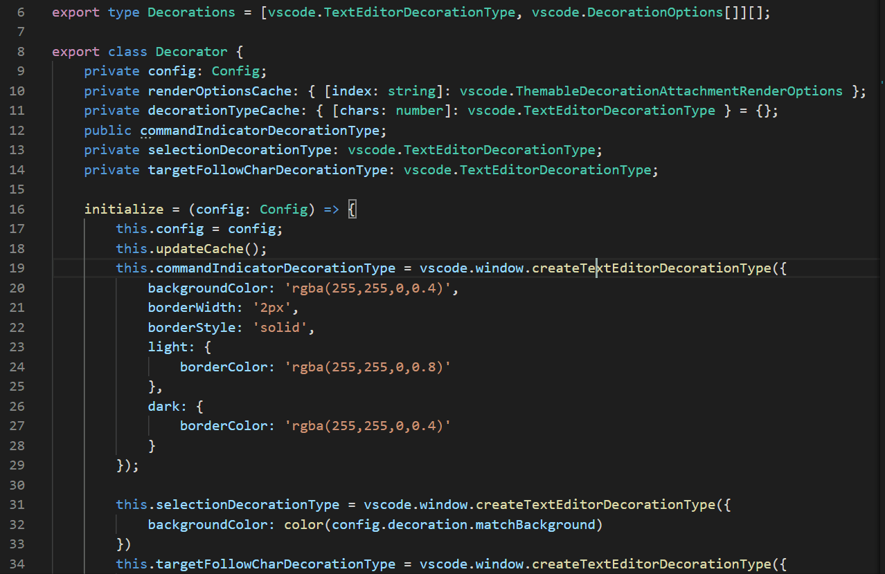
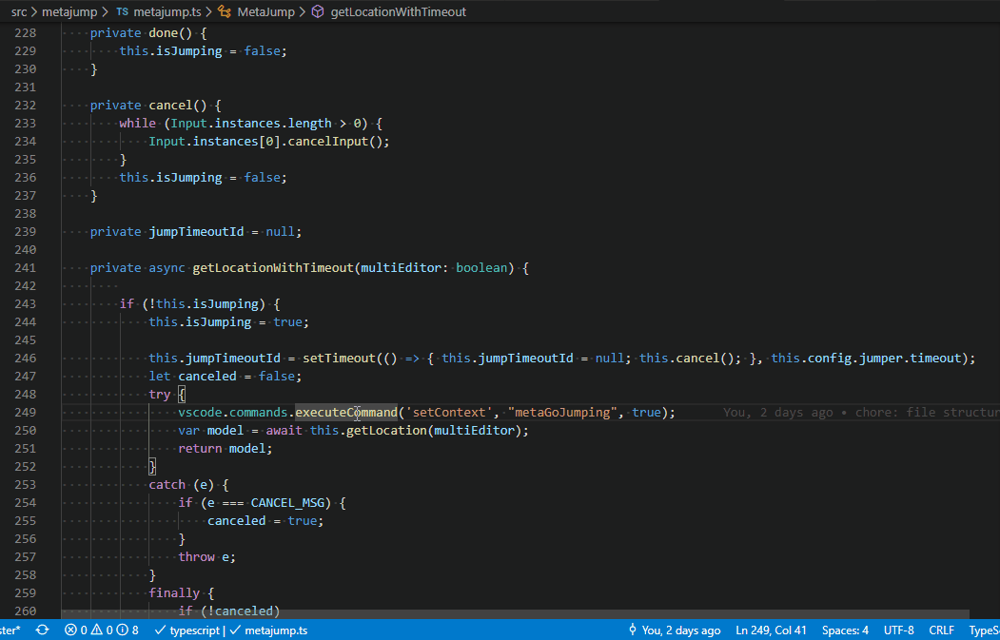

<table align="center" width="68%" border="0">
  <tr>
    <td>
      
    </td>
    <td>
      
       
    </td>
    <td>
      
    </td>
  </tr>
</table>
 

## MetaJump

### features highlight
* code characters are based on priority, the character easier to type has higher priority. i.e. 'k','j', and code characters are configurable.
* at anytime continue typing would narrow down the candidate positions range.
* code character decorator is encoded with one or more characters, the code characters around cursor are easier to type.
* only encode characters on viewable screen area, so metaGo is faster.
* support having fold regions.
* support jumping to all opened editors.
* support adding multiple cursors and do multiple selections.
* compatible with the vim plugins.

[*➭Feature Summary⮵*](https://github.com/metaseed/metaGo/blob/master/README.md#features-summary)

### go to any character on screen
1. type <kbd>Alt</kbd>+<kbd>/</kbd> to tell I want to *go* somewhere. (Trigger)
2. type the characters(stands for the target location) on screen, metaGo will show you some decorator codes(candidate target locations) encoded with characters. (you could hold the <kbd>/</kbd>(configurable) to hide the location decorators, release to show again)
3. you could continue type characters following the target location to narrow down the possible targets range, or type the code decoration characters of one location to *go* to that target location.

> at any time press <kbd>ESC</kbd> to cancel the command; <kbd>Backspace</kbd> to cancel last typed char in target-char-sequence. (<kbd>Backspace</kbd> triggers 'step-cancel')    

> to show less decorators on screen, metaJump introduces 'ripple-encoding' support, : type target-location-chars to encode locations far from center(cursor location) by steps.
> 1. one target-char for current section(separated by empty lines);
> 1. two target-chars for current doc;
> 1. three or more target-chars for all opened editors;  
> 
> for one or two target-chars, one-char-decorators will pass through boundaries(section or document) if possible. (i.e. for one-target-char, one-char-decorators has encoded all possible target locations in the section, then it will continue encodes until all one-char-decorators are used up).  

> Note: <kbd>Enter</kbd> and <kbd>Space</kbd> are also usable as location characters. <kbd>Enter</kbd> means the end of line. You could press <kbd>Enter</kbd> any times to trigger the decorator-encoding for the line-end out side of current section(2 times) or document(3 times). (like a ripple)    

* the <kbd>Alt</kbd>+<kbd>.</kbd> shortcut will trigger the metaGo.gotoAfter command, the cursor will be placed after the target character;    
* the <kbd>Alt</kbd>+<kbd>,</kbd> shortcut will trigger the metaGo.gotoBefore command, the cursor will be placed before the target character;
* the <kbd>Alt</kbd>+<kbd>/</kbd> shortcut will trigger the metaGo.gotoSmart command which intelligently set cursor position after navigation:
    * if the target is at the begin of the word, the cursor will be set before target character, otherwise after it;
    * The 'word' is defined as a group of all alphanumeric or punctuation characters.

> commands that only navigate in the active editor are also provided: metaGo.gotoAfterActive, metaGo.gotoBeforeActive, metaGo.gotoSmartActive, you could assign shortcuts by yourself.

[*➭Feature Summary⮵*](https://github.com/metaseed/metaGo/blob/master/README.md#features-summary)

### select to any character in the active editor
1. type <kbd>Alt</kbd>+<kbd>Shift</kbd>+<kbd>/</kbd> to tell I want to *select* to somewhere.
2. type the character(stands for location) on screen, metaGo will show you some codes encoded with character.
3. type the code characters, you will *select* to that location.
4. repeat 1-3 to adjust your current selection.
> at any time press <kbd>ESC</kbd> to cancel, or press <kdb>Backspace</kbd> to do step cancel to re-input last typed character

> support to do multiple selections, 

### add multiple cursors to the active editor or change the active selection from multiple selections
1. <kbd>Ctrl</kbd>+<kbd>Alt</kbd>+<kbd>,</kbd> to add another cursor before the target-character.
1. <kbd>Ctrl</kbd>+<kbd>Alt</kbd>+<kbd>.</kbd> to add another cursor after the target-character.
1. <kbd>Ctrl</kbd>+<kbd>Alt</kbd>+<kbd>/</kbd> to add another cursor smartly to the target-character.

> <kbd>Ctrl</kbd>+<kbd>u</kbd> to cancel last cursor action.  

> the three add-cursor commands would become change-active-selection commands if the target location is inside a selection. It is useful to modify multiple selection ranges, just select one selection as the active one and do extending or shrinking there.

#### add-multi-cursors demo
we want to modify the three wrongly spelled words, `alt+/` to goto the end of one of them, and `ctrl+alt+/` two times to add two additional cursors to the end of the other two words, `ctrl+backspace` to delete them together, `esc` to escape multi-cursor mode:

[*➭Feature Summary⮵*](https://github.com/metaseed/metaGo/blob/master/README.md#features-summary)

### change active selection in multiple selections
#### change-active-selection demo
in the gif, we use `alt+shift+/` do selection, then `alt+a`(provided in MegaGo plugin) to alternate selection's active with anchor, then `alt+shift+/` to extend selection from another end; then we use `ctrl+alt+/` to add another cursor to code above, `alt+shift+/` to do selection, then `ctrl+alt+/` to make the first selection active, `alt+shift+/` to shrink selection there:

[*➭Feature Summary⮵*](https://github.com/metaseed/metaGo/blob/master/README.md#features-summary)